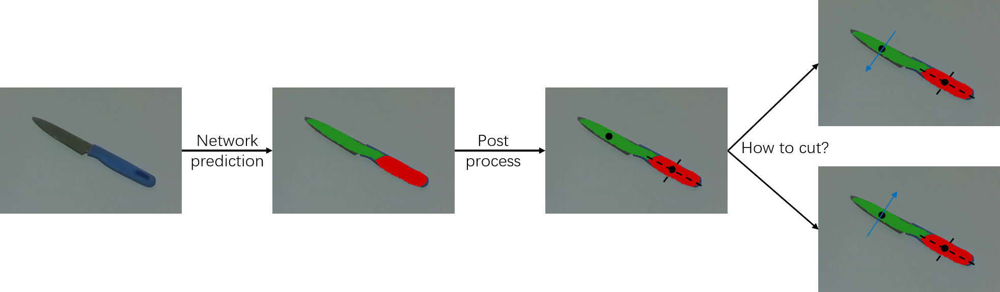
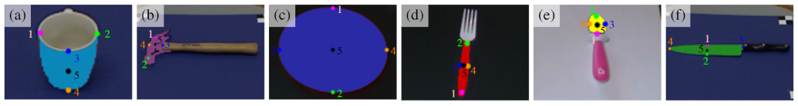
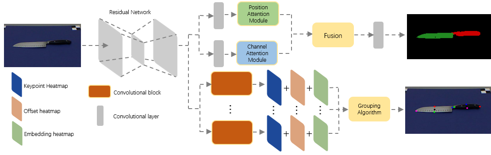
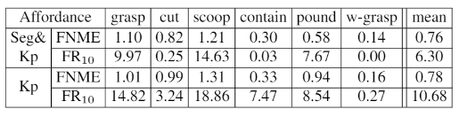
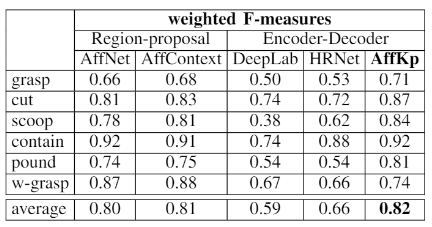

# An Affordance Keypoint Detection Network for Robot Manipulation
Ruinian Xu, Fu-Jen Chu, Chao Tang, Weiyu Liu and Patricio A. Vela

## Description of Contents
This repository is mainly designed for two purposes. One is to reproduce the work of An Affordance Keypoint Detcetion Network for Robot Manipulation. The other one is to provide supplementary material for readers to have a better understanding of our RA-L work, _AffKP_.

The outcomes are mainly composed of two parts. One performs vision benchmarking and the other physical manipulation testing. For either training or evaluating AffKp on the proposed dataset, readers can refer to the following section of [Usage](#usage). For the physical experiment, the detail of the implementation is provided in the [experiment.md](https://github.com/ivalab/AffKpNet/blob/master/readme/experiment.md), which provides corresponding codes and describes how the proposed work converts 2D affordance keypoints to 3D execution information.

#### Supplementary Material
Due to the page limit of RA-L, to help readers better understand our work we offer several supplementary materials here. 

_Keypoint description:_ The [keypoint_visualization.md](https://github.com/ivalab/AffKpNet/blob/master/readme/keypoint_visualization.md) aims to help better understand keypoint representation defined for affordance in robotic manipulation. 

_Keypoint grouping:_ Including more visualizations and explanations, the [algorithm.md](https://github.com/ivalab/AffKpNet/blob/master/readme/algorithm.md) detailedly explain the mechanism of the keypoint grouping algorithm. 

_Keypoint 2D to 3D Post-Processing:_ **ADD HERE**

_Dataset Additions and Annotation:_ For the proposed UMD+GT affordance segmentation and keypoint dataset, the visualization of all objects is in the [dataset_visualization.md](https://github.com/ivalab/AffKpNet/blob/master/readme/dataset_visualization.md) and the tutorial of annotating ground truth is provided in the [annotation_tool.md](https://github.com/ivalab/AffKpNet/blob/master/readme/annotation_tool.md). These tools may help readers save some time for generating keypoints and segmentation ground-truth for their own datasets.

_Keypoint Only Method:_ To show the benefit of incorporating the affordance segmenation branch into the multi-task affordance learning framework. Besides performing vision only benchmarking for the keypoint-only model, we also implemented the manipulation experiments to test the performance of the keypoint-only model when used for actual manipulation. The experimental protocol and results are documented in the [keypoint_only_physical_experiment.md](https://github.com/ivalab/AffKpNet/blob/master/readme/keypoint_only_physical_experiment.md). The resuls show that the keypoint-only method has reduced performance across the board, from perception to action.

_Comparison to AffContext Method:_ To show the benefit of incorporating affordance keypoints to address the potential performance drop caused by the post-processing of the segmentation mask. Based on the qualitative assessment provided in the paper, we also compared the performance of converted 3D information between _AffContext_ and _AffKp_ methods. The related discussion is documented in the [seg_only_performance_variety_test.md](https://github.com/ivalab/AffKpNet/blob/master/readme/seg_only_performance_variety_test.md).

_AffKP Generalization - Occlusions:_ In order to evaluate the generalization of AffKp, we designed three different tests. 
The first one is to explore the performance of AffKp for the scenario with occlusions. The result is recorded in the [occlusion.md](https://github.com/ivalab/AffKpNet/blob/master/readme/occlusion.md). The key takeaway is that _AffKP_ performance degrades because there is no mechanism in the grouping algorithm to handle partial observations of objects, nor abutting affordance categories unrelated to the object.

_AffKP Generalization - Intra-Object Variation:_ The second test is designed to evaluate AffKp recognition performance for object variation with the same category (and not in the annotated dataset). The result is recorded in the [object_variety_test.md](https://github.com/ivalab/AffKpNet/blob/master/readme/object_variety_test.md). Based on the results of physical experiments, AffKp is found to be capable of providing good recognition for objects with similar overall geometry (though still variable).  The main source of performance degradation will be for objects with visually confounding properties (i.e., uniformly colored) and subtle or unlearnt geometry (i.e., shapes not seen in the training dataset especially at abutting affordance part boundaries).

_AffKP Generalization - Out of Distribution:_ This last test uses objects whose geometries are truly different from objects in the dataset and evaluate AffKp over these objects. The result is recorded in the [out_of_distribution.md](https://github.com/ivalab/AffKpNet/blob/master/readme/out_of_distribution.md). The mixed but mostly poor results are sensible since neural networks are not good at output prediction of objects living far outside of the expected input distribution. Output extrapolation from inputs not within the provided input domain is an unsolved problem in the area of function approximation or function regression. Correct extrapolation requires known prior information about the function output outside of the known input domain. Such prior information does not exist for this problem, nor generically for most other problems.

<!-- The design of the network architecture is introduced in the [network.md](https://github.com/ivalab/AffKpNet/blob/master/readme/network.md). -->
## Table of Contents
- [Introduction](#Introduction)
- [Result](#Result-1)
  * [segmentation](#UMD-GT-segmentation-result)
  * [keypoint](#UMD-GT-keypoint-result)
- [Usage](#Usage)
- [Installation](#Installation)


## Introduction

General purpose robotic manipulation requires robots to understand how objects may serve different purposes. Affordancces describe potential physical interactions between objects parts, and associate objects parts to actions for planning manipulation sequences. General manipulation ransoning and execution requires identifying: ***what*** the affordances of seen object parts are, ***where*** on the object that affordances act or should be acted on by the manipulator, and ***how*** the manipulator should execute the affordance's action. Recent studies of affordance cast affordance detection of object parts in the scene as an image segmentation problem. Object part pixels sharing the same functionality are predicted to have the same category and grouped into one instance. The segmentation-only methods obtain ***what*** information from the affordance mask and ***where*** information by post-processing the mask to compute its center location, as shown in the Figure 1. However ***how*** information is missing in these methods. Taking the knife as example, from the segmentation mask, it is hard to predict which side is blade. In order to provide the complete information for robotic manipulation, we propose to use a set of keypoints to represent each affordance. As shown in the Figure 2, for those affordances require certain way to operate like the cut and pound, keypoints 1 and 2 determine the operational direction. We also propose an Affordance Keypoint Detection Network (AffKp) to provide affordance segmentation and keypoint prediction for object parts. The network architecture is shown in the Figure 3.


Fig. 1 - Pipeline of segmentation-only methods.

Fig. 2 - Affordance keypoint representation for six affordances.

Fig. 3 - Affordance keypoint detection network architecture.

## Result
### UMD GT segmentation result




Fig. 4 - Result of affordance segmentation over UMD+GT dataset.

### UMD GT keypoint result




Fig. 5 - Result of affordance keypoint detection over UMD+GT dataset.

## Usage

1. Install pytorch 

  - The code is tested on python3.6 and official [Pytorch@commitfd25a2a](https://github.com/pytorch/pytorch/tree/fd25a2a86c6afa93c7062781d013ad5f41e0504b#from-source), please install PyTorch from source.
  - The code is modified from [DANet](https://github.com/junfu1115/DANet). 
  
2. Clone the repository:

   ```shell
   git clone https://github.com/ivalab/AffKpNet
   cd AffKpNet 
   python setup.py install
   ```
   
3. Dataset

  - Download the [UMD+GT](https://sites.google.com/view/rgb-d-aff-kp-dataset) dataset.
  - Please put dataset in folder `./datasets`

4 . Evaluation

  - Download trained model [AKNet](https://www.dropbox.com/s/kfcxxwpq9z540wo/best_checkpoint.pth.tar?dl=0) and put it in folder `./danet_kp/umd_gt/model`
  - Evaluation code is in folder `./danet_kp`
  - `cd danet`

  - For evaluating affordance segmentation, please run:
  
   ```shell
   CUDA_VISIBLE_DEVICES=0 python test_aff_mask.py --dataset umd_self_kp --model danet_kp --resume-dir /danet_kp/umd_gt/model --base-size 480 --crop-size 480 --workers 1 --backbone resnet101 --multi-grid --multi-dilation 4 8 16 --eval
   ```
   
  - For evaluating affordance keypoint, please run:
  
   ```shell
   CUDA_VISIBLE_DEVICES=0 python test_aff_kp.py --dataset umd_self_kp --model danet_kp --resume-dir /danet_kp/umd_gt/model --base-size 480 --crop-size 480 --workers 1 --backbone resnet101 --multi-grid --multi-dilation 4 8 16 --eval --multi-scales --eval
   ```  
   
5. Evaluation Result:

   The expected scores should be same or similar to the Tables attached above.


6. Training:
  - The pretrained model can be downloaded from [ResNet](https://www.dropbox.com/s/zfi2se12ahfbsv8/resnet101-5be5422a.pth?dl=0). The downloaded model should be put under `./danet_kp/pretrain_models`

  - Training code is in folder `./danet_kp`
  - `cd danet_kp`
  
   You can reproduce our result by run:

  ```shell
   CUDA_VISIBLE_DEVICES=0 python train_aff_kp.py --dataset umd_self_kp --model  danet_kp --backbone resnet101 --checkname danet101_kp  --base-size 480 --crop-size 480 --epochs 10 --batch-size 4 --lr 0.0001 --workers 2 --multi-grid --multi-dilation 4 8 16 --log-root ./umd_gt/log
   ```

## Installation

### environment
Use `anaconda` for `python3`, `pytorch 1.0` and `cuda8.0`.
Currently the `maskrcnn_benchmark` environment is shared with this project. `source activate maskrcnn_benchmark
`

### library issue
1. No need to install the lib.   
2. To use the library, clone `https://github.com/huanghoujing/PyTorch-Encoding` for libraries. Otherwise, you will have problem when compiling the libs. 
3. Replace `encoding/lib` with the one in `huanghoujing`
4. In `encoding/functions/syncbn.py`, replace with 'xsum, xsqusum = lib.cpu.sumsquare_forward(input)##gpu->cpu
' for cpu implementation

### single GPU
In `danet_kp/train_aff_kp.py`, replace `norm_layer=BatchNorm2d` with `norm_layer=torch.nn.BatchNorm2d`


## Citation
If AKNet is useful for your research, please consider citing:
```
```

## Acknowledgement
Thanks [DANet](https://github.com/junfu1115/DANet).
