## Introduction
This tutorial mainly discusses the keypoint grouping algorithm. The pipeline can be mainly divided into four steps. We include rich figures for better illustration. The example
is shown in the following:

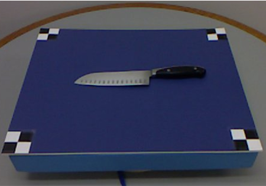

Fig. 1 - Example image.

The pseudo-code is attach for better understanding. 

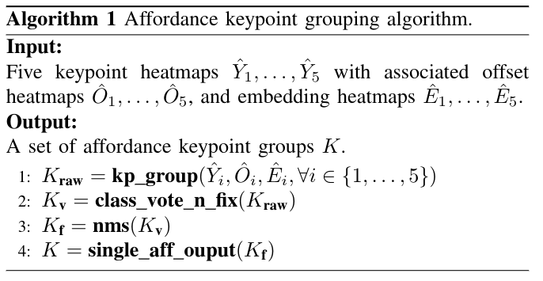

Algorithm. 1 - Pseudo code for the keypoint grouping algorithm.

## Step 1
As shown in the Fig. 2-6, there will be some highlight pixels over some areas on each heatmap. Top-K keypoints will be selected from each heatmap based on its 
confidence score. The different color is for indicating different keypoint. The pink, green, blue, orange and black repsents the 1, 2, 3, 4 and 5 keypoint.
Since there are five heatmaps, there will five sets of selected keypoints. After collecting keypoints from heatmap, associated offset and embedding values will be 
extracted from offset and embedding heatmap based on the coordinates of the keypoint. All selected 
keypoints will form K1\*K2\*K3\*K4\*K5 groups. In order to rank each group, the score will be computed as the equation 1.

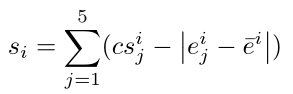

Equation. 1 - Scoring function for each affordance keypoint group.

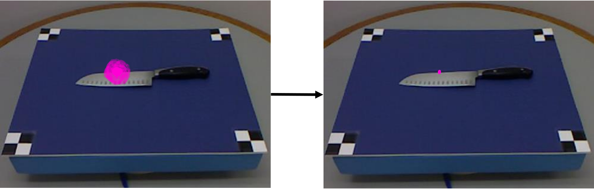

Fig. 2 - Select top keypoints from the heatmap of keypoint 1.

Fig. 3 - Select top keypoints from the heatmap of keypoint 2.

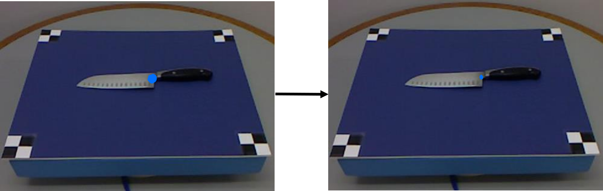

Fig. 4 - Select top keypoints from the heatmap of keypoint 3.

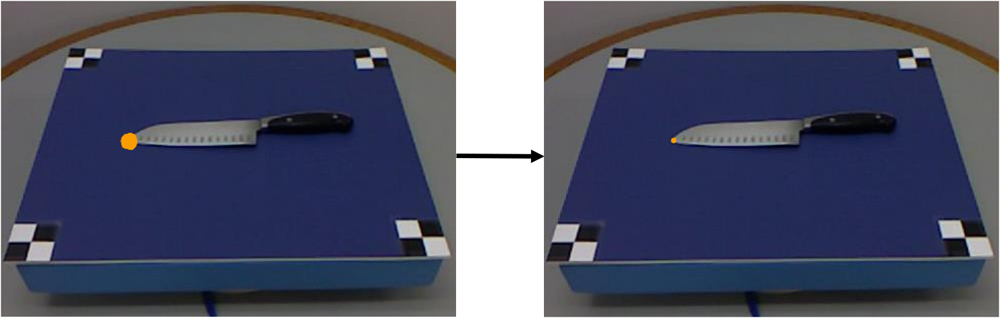

Fig. 5 - Select top keypoints from the heatmap of keypoint 4.

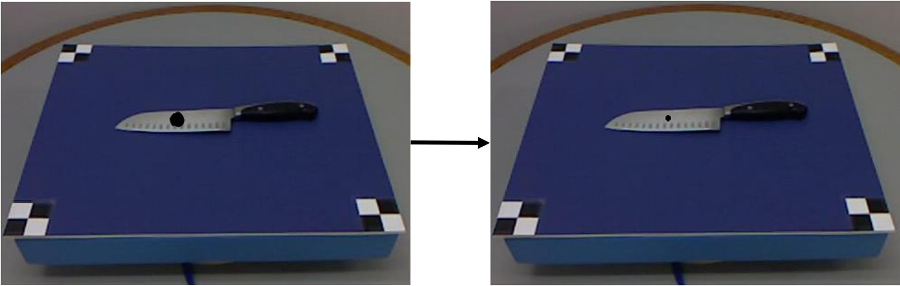

Fig. 6 - Select top keypoints from the heatmap of keypoint 5.

## Step 2

Just clarify that we didn't use 5 different colors in the Figure 7 since we don't want to make confusion. In the Figure 7, pixels whose color is the same share the same affordance category. The red pixels have the cut affordance and the blue pixels have grasp affordance. Since we don't force the keypoints grouped by the first step should have the same affordance, the algorithm will vote the final affordance category based on categories of five keypoints. If there are any keypoints whose category mismatches the final category, it will be correctized based on the geometry constraint of that affordance.

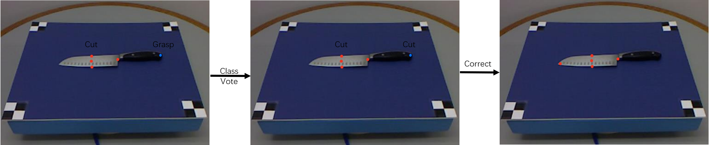

Fig. 7 - Class vote and error fix.

## Step 3

The step 3 is mainly for filtering out bad groups based on the mechanism of non-maximum surpression. There are two ways, group-level (Figure 8) and keypoint-level (Figure 9). In the  Figure 8, pixels with the same color belong to the same group. There are two keypoint groups in the Figure 8. As shown in the Figure 8, the blue group is very close to the red group. The algorithm will filter the blue group if its total distance between the red group is within 40 pixels and its socre is less than the red one. There is only one keypoint group in the Figure 9. The different color indicates the order of the keypoint, which is the same as the Step 1. As shown in the Figure 9, the red pixel is too close to the green one. The threshold is set to be 4\*sqaure_root(2). Such kind of keypoint group will be filtered out.

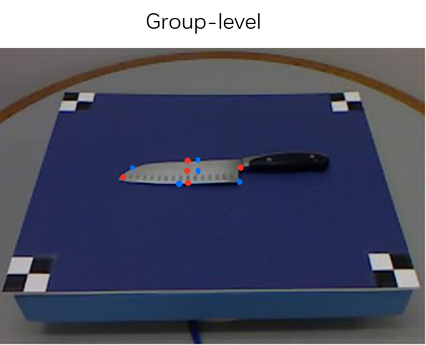

Fig. 8 - Group-level nms.

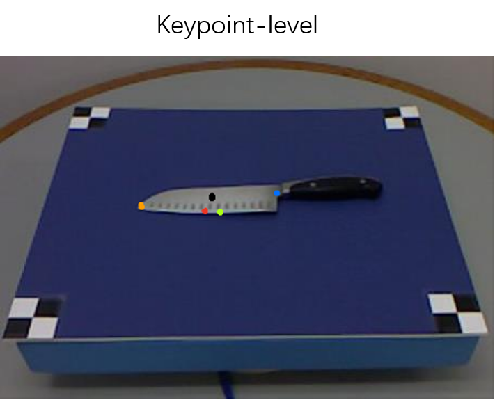

Fig. 9 - Keypoint-level nms.

## Step 4

This step mainly outputs keypoint group for each affordance category. The grasp affordance is not shown in the example image but it actually gets predicted.

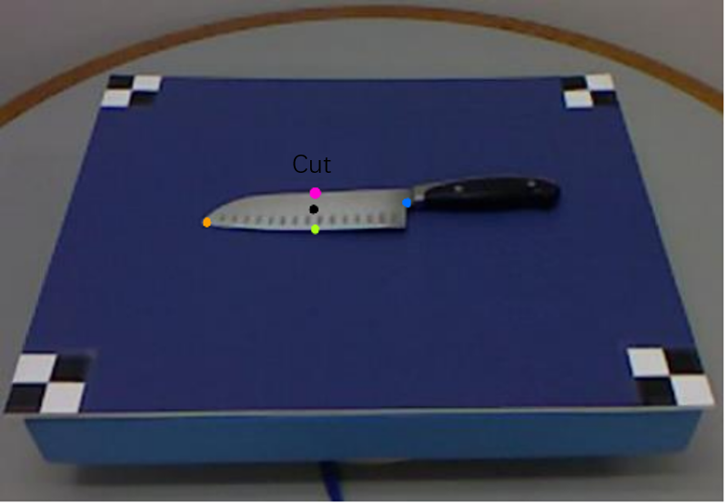

Fig. 10 - Final output.
