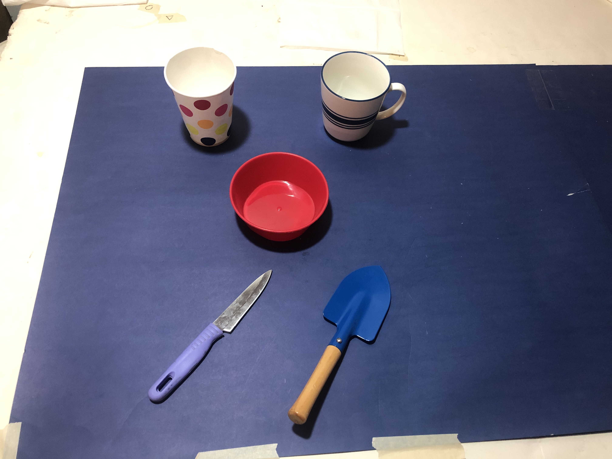
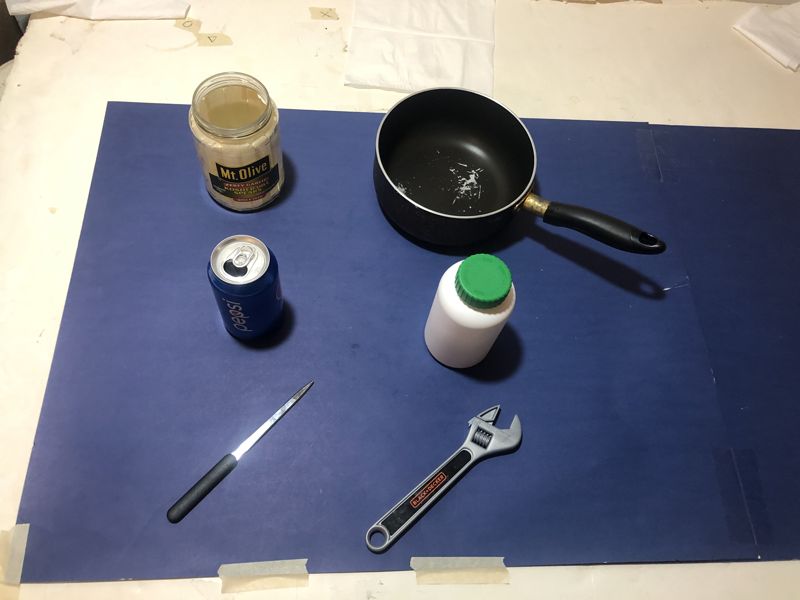

# Overview

For study completeness, this file documents a keypoint network experiment. The objective of the experiment is to compare the performance gap between the segmentation and keypoint model _AffKP_ and the keypoint-only model as a perception processing algorithm and when translated to real-world physical manipulation. The segmentation and keypoint model is _AffKP_  with segmentation and keypoint branches. The segmentation branch is served as supplementary task to form the  multi-task learning framework, and to assist with visually separable multi-object processing. The keypoint-only model represents the model with only keypoint detection branch. We've shown in the paper that the segmentation and keypoint model outperforms the keypoint-only model in vision benchmarks. Here, we design this experiment to explore the performance of the keypoint-only model in the physical experiment, with testing of the perception and planning components included. At this level, the tests further establish how well the 2D keypoints lead to reasonable 3D reference frames and scale information for follow on manipulation. Perception errors may or may not translate to 3D reasoning errors or manipulation planning errors.

**Outcomes Summary:** The experiment outcomes show that keypoint only processing has inferior performance to _AffKP_ across the board. The net result is lower perception processing success, as well as reduced manipulation success.

# Experimental Setup
The test considers manipulating objects from unseen instances and categories. The affordance testes are: grasp, contain, and wrap-grasp. For each affordance, there are 2 objects with 10 trials per object. Each object follows the same methodology as noted in the manuscript; it will be placed on the table with a random location and orientation about the object's z-axis.

## Grasp
We employ a top-down (2.5D) grasp strategy when performing the grasp action. During each trial, the manipulator will first approach above the object. Then it will come down and close the gripper to grab the object. In the end, it will lift the object into the air.

## Wrap-grasp
We employ a sideways (2.5D) grasp strategy. The manipulator will approach the object from a specific direction, which means the manipulator only needs to know how far it should travel. During each trial, the manipulator will first move to a place in front of the object with the gripper claws oriented towards the object. Then it will move forward, close the gripper, and raise it (plus the object if the grasp was successful).

# Contain
During each trial, the manipulator will transport the pre-grasped object into the place indicated by the contain affordance. The manipulator will move above the object and release the gripper.

# Object set

## Unseen object instance

## Unseen object category

# Evaluation metric

## Grasp
Each trial is considered as successful if the object is lifted in the air for 3 seconds.

## Wrap-grasp
Each trial is considered as successful if the object is lifted in the air for 3 seconds.

# Contain
Each trial is considered as successful if the pre-grasped object falls into the tested object.

# Result

## Unseen object instance
|   |  | Keypoint-only |  |  |
| :----------: | :----------: | :----------: | :----------: | :----------: |
| Object  | Perception  | Plan  | Action  | Affordance  |
| knife  | 7  | 7  | 7  |  grasp |
| trowel  | 9  | 9  | 9  |  grasp |
| bowl  |  9 |  9 | 9  | contain  |
| mug  |  10 | 10  | 10  | contain  |
| cup  | 9  | 9  |  9 | wrap-grasp  |
| mug  | 10  | 10  | 8  |  wrap-grasp |
| Success rate  | 90.0%  |  90.0% |  86.7% |   |

## Unseen object category
|   |  | Keypoint-only |  |  |
| :----------: | :----------: | :----------: | :----------: | :----------: |
| Object  | Perception  | Plan  | Action  | Affordance  |
| letter opener  | 10  |  10 |  10 | grasp  |
| wrench  |  9 |  9 |  9 |  grasp |
| jar  | 9  | 9  | 9  | contain  |
| pot  | 10  | 10  |  6 |  contain |
| pepsi can  | 4  | 4  | 4  |  wrap-grasp |
| medicine bottle  | 5  | 5  | 5  | wrap-grasp  |
| Success rate  |  78.3%  | 78.3%  | 71.7%  |   |

# Discussion

**Unseen Object Instance:** As shown in the Table of unseen object instance, the keypoint-only model achieves 90.0% success rate for Perception and Plan stage, and 86.7% for Action stage (equivalent to the triplet 90.0%, 90.0%, 86.7%). Compared to the result of AffKp (100%, 98.3%, and 97.5%), the keypoint-only model provides poor affordance keypoint detection during the experiment. First of all, there are more cases of no detection as indicated by the higher FR10 error in the manuscript. Three failure cases of knife and the only failure case of bowl were caused by missed detections for the associated affordance. Secondly, the model shows relatively poor capability of differentiating permuted keypoints. Taking the failure case of the trowel for example, keypoints 3 and 4 were predicted on the same side such that grasp orientation was predicted wrong. The same issue happened for the failure of the cup in the wrap-grasp task. The keypoints 1 and 2 of cup were predicted on the same side such that the estimated radius was nearly zero, which led to the failure that the gripper did not move forward enough to achieve grasp closure. The missing detection and relatively poor performance of differentiating permuted keypoints shows that the segmentation branch in the proposed method helps to reason about affordance geometry and distinguishes areas for object parts.

**Unseen Object Category:** For the result of unseen object category, the keypoint-only model achieves 78.3% success rate for the Perception and Plan stage, and 71.7% for Action stage (for a 78.3%, 78.3%, and 71.7% triplet). Compared to the result of AffKp (100%, 100%, 100%), there are performance drops of 21.7% for Perception and Plan stage, and 28.3% for Action stage. The keypoint-only model performed badly for the Pepsi can and medicine bottle. The major reason for the failure cases is that the model can't detect the _wrap-grasp_ affordance, which shighlights a shortcoming of the keypoint-only model. The rest of the failure cases were caused because the model detected the _contain_ part as the _wrap-grasp_ affordance. For the other four objects, even though the success rate for the Perception stage is high, there is an obvious performance drop between the Perception and Action stage. The issue comes from the pot object. The keypoint-only model detected the contain affordance but the center keypoint was predicted at the edge of the pot. The imperfect affordance keypoint lead an Action failure. The above observations of missing, incorrect, imperfect detections by the keypoint-only model shows that the keypoint-only model does not provide robust affordance keypoint detection based on the similar geometry of unseen objects to known seen objects. The results suggest that the segmentation helps the keypoint branch to correctly interpret the affordance for the object parts. 

**Point-Based and Volumetric Information for Affordances:**
These outcomes align with the kPAM versus kPAM-SC results, where kPAM-SC adds volumetric information in the form of a shape completion step based on the recognized object category. At the high-level kPAM-SC basically observes that 3D keypoint information plus volumetric information is essential to improved keypoint recognition and for subsequent manipulation planning. kPAM-SC enhances the keypoint method with volumetric information. For AffKP, which is an image-based processing method, the equivalent would be combintation of 2D keypoint and 2D image segmentation. AffKP adds image keypoints (2D) to AffContext (2D segmentation-only method), thereby enhancing a volumetric method with keypoints. Recognizing both structurally important points and part regions assists in capturing the overall 3D geometry needed for follow-up manipulation planning. With the recovery of keypoint + volumetric information, kPAM-SC and AffKP improve upon their keypoint only or volumetric only predecessors. Whether it is preferable to generate 3D outputs or 2D image-based outputs is still indeterminate. In light of Marr's visual hierarchy, there is an argument in favor of some form of 2.5D visual representation being useful, which would bias processing in favor of image-based outputs. However, combining them with 3D outputs may permit them to serve as a prior for improving the overall outcomes, especially regarding the generation of collision-free manipulation plans.
