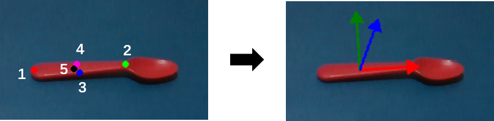
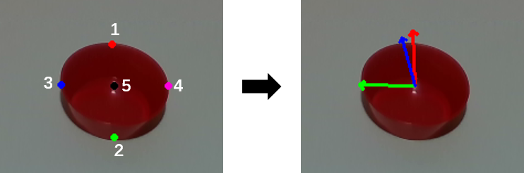
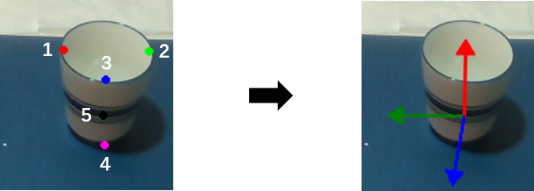
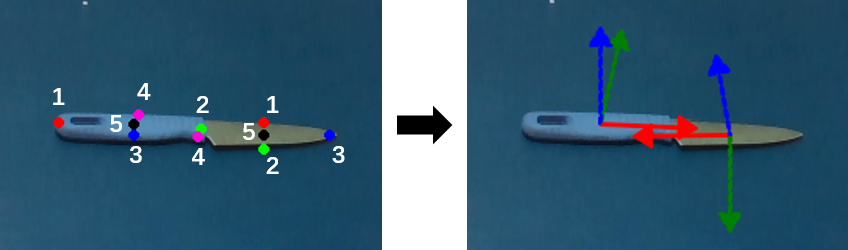

# Overview
Due to the page limit of RA-L, we couldn't provide comprehensive discussion about our implementation from 2D affordance keypoint to 3D pose. The file documents 
the implementation about conversion from 2D to 3D in all three physical experiments.

# Approach
We mainly employ two pairs of keypoints and the center keypoint to determine two axes (x, y) and origin of the frame. We use red, green and blue
axes to repsent the x, y and z axes. In order to avoid confusion,
the x-axis always represents the principle axis of the object part. However, the axis required for different tasks won't always be the x-axis.
Taking the knife as example, the axis of keypoints 3 and 4, which determines the grasping orientation, is what we need for the grasp task. 
One more thing to remind is that the line of keypoints 1 and 2 isn't gauranteed to be orthogonal to the line of keypoints 3 and 4. During the conversion, we will firstly
determine the task-dependent axis by the corresponding predicted keypoints and the task content. Then the orthogonal axis will be computed by both the task-dependent axis and
its corresponding keypoints. The last axis is computed by cross-product. 
The detail will be introduced in the following sections.

## Single object manipulation

### Grasp
We employ 2.5D top-down grasp, which means only grasping location and orientation are needed to perform valid grasp. 
The origin of the frame is determined by the keypoint 5. The task-dependent axis which is the y-axis is computed by keypoints 3 and 4. 
Then the x-axis is computed by y-axis and keypoints 1 and 2. Lastly the z-axis is computed by cross-product.

### Contain
The contain task only requires the 3D location to drop the pre-grasped object off. The origin of the frame is computed by the keypoint 5. The axis is set to be default.

### Wrap-grasp
We employ similar 2.5D face-forward grasp, which means only grasping location and orientation are needed to perform valid grasp. 
The origin of the frame is determined by the keypoint 5. The task-dependent axis which is the y-axis is computed by keypoints 1 and 2. 
Then the x-axis is computed by y-axis and keypoints 3 and 4. Lastly the z-axis is computed by cross-product.

## Object arrangement

### Tableware
To arrange the tableware, it requires understanding its pose and how to grasp it. 
The y-axis is computed by keypoints 3 and 4, which determines the grasping orientation.
To gaurantee orthogonal, the x-axis is computed by keypoints 1 and 2, and the y-axis.
The x-axis is used to infer the pose of the tableware.
Lastly, the z-axis is computed by cross-product.

### Mug/Cup
The way of generating wrap-grasp strategy is the same as before. In the object arrangement task, keypoints 3 and 4 are additionally used to 
infer the pose of the mug.

## Direction Dependent Manipulation

### Knife
The cut task involves two affordances: _grasp_ and _cut_. 
The _grasp_ affordance which is already introduced above.
For _cut_ affordance, the y-axis, which indicates the operational direction, is computed by the keypoints 1 and 2.
Similarly the x-axis is computed by both y-axis and keypoints 3 and 4.
Lastly, the z-axis is computed by cross-product.

### Hammer
The pound task involves two affordances: _grasp_ and _pound_. The _grasp_ affordance which is already introduced above.
For _pound_ affordance, the y-axis, which indicates the operational direction, is computed by the keypoints 1 and 2.
Similarly the x-axis is computed by both y-axis and keypoints 3 and 4.
Lastly, the z-axis is computed by cross-product.

