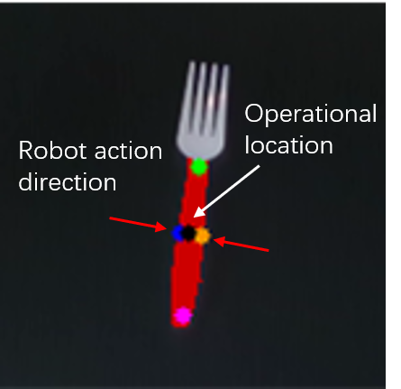
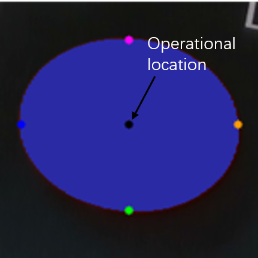
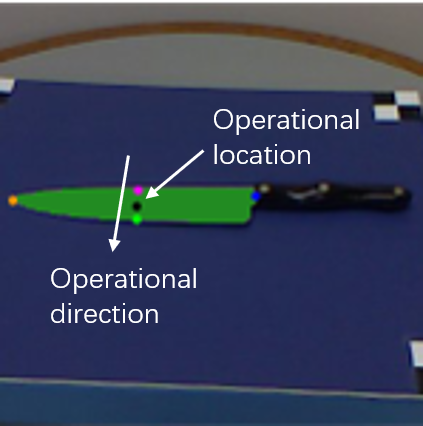
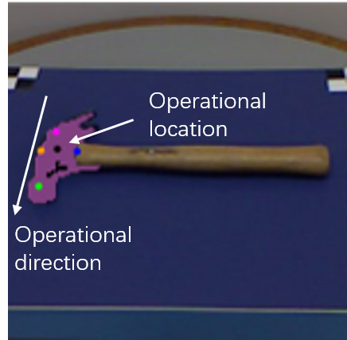
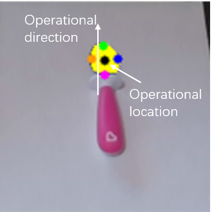
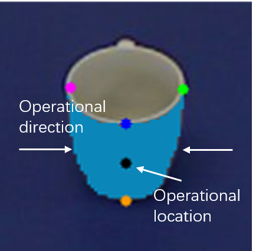

## Introduction
This file mainly illustrates how the affordance keypoints are used in the real-world physical experiments. 
As mentioned in the manuscript, there are five in total keypoints for each affordance. The keypoints 1 and 2 determine the operational direction of the object part.
The keypoints 3 and 4 are auxiliary points, which help complete the geometry of the object part. They are important especially for the grasp affordance. 
As shown in the Fig. 1, the keypoints 3 and 4 help determine the rotation angle of the robot arm to achieve top-down grasp. 
The keypoint 5 is the center point of the object part.

### Grasp
As shown in the Fig. 1, the operational location is computed by the keypoint 5 with depth information. For all physical expeirments, top-down grasp is employed. 
The operation direction, which is acutally the rotation angle of the robot wrist, is determined by the keypoint 3 and 4.

Fig. 1 - Operational location and direction converted from affordance keypoints for the grasp affordance.

### Contain
For the contain affordance, there is no operational direction. The operational location is computed by the keypoint 5 with depth information.

Fig. 2 - Operational location and direction converted from affordance keypoints for the contain affordance.

### Cut
For the cut affordance, it requires determining where and how to cut. The operational location is computed by the keypoint 5 with depth information. 
The operational direction is computed by the keypoints 1 and 2.

Fig. 3 - Operational location and direction converted from affordance keypoints for the cut affordance.

### Pound
For the pound affordance, it requires determining where and how to pound. The operational location is computed by the keypoint 5 with depth information. 
The operational direction is computed by the keypoints 1 and 2.

Fig. 4 - Operational location and direction converted from affordance keypoints for the pound affordance.

### Scoop
For the scoop affordance, it requires determining where and how to cut. The operational location is computed by the keypoint 5 with depth information. 
The operational direction can be determined by either affordance mask or keypoints. By the affordance mask, the operational direction can be determined by the 
relative position between the grasp and scoop affordance. By the affordance keypoint, the operational direction is computed by the keypoints 1 and 2.

Fig. 5 - Operational location and direction converted from affordance keypoints for the scoop affordance.

### Wgrasp
Similar to the grasp affordance, we only employ 2.5D pose for wrap-grasp. The wrap-grasp pose is always straightly facing at the target object. 
The operational location is computed by the keypoint 5 with depth information.

Fig. 6 - Operational location and direction converted from affordance keypoints for the wgrasp affordance.
