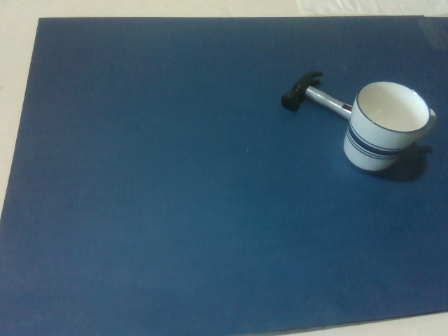
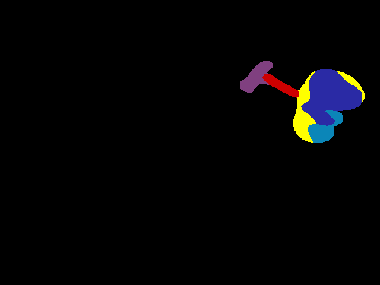
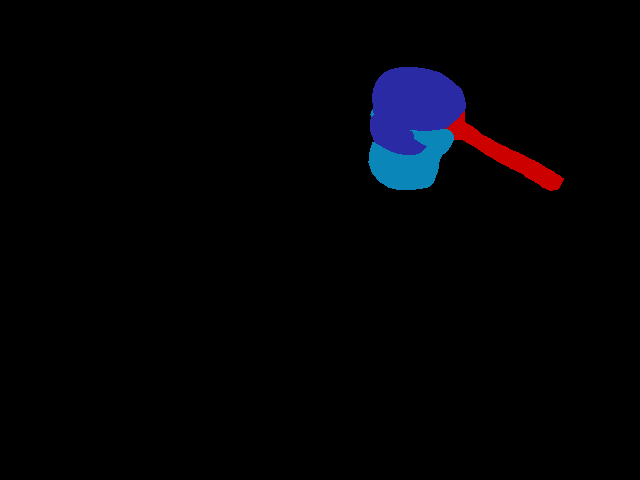
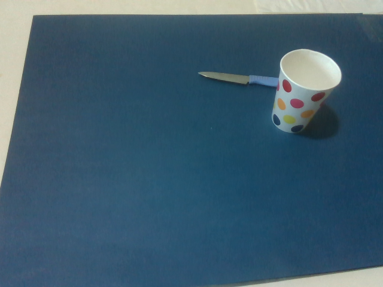
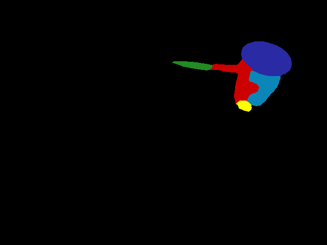
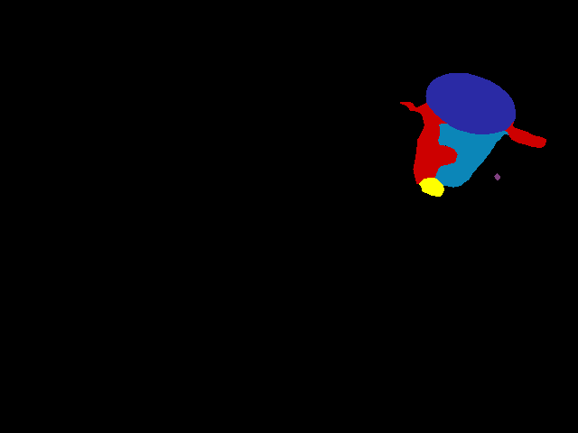

## Introduction
This markdown file includes the investigation result of performing the proposed network for the occlusion scenarios. Since the current keypoint grouping algorithm only supports outputing one keypoint group for each category, we only include objects whose affordance categories are different. 

## Visualization

### Scene 1

### Scene 2

### Scene 3

### Scene 4

## Observation
As shown in the visualization,  the proposed method is still capable to provide reasonable affordance keypoint prediction. The unoccluded part is still predicted with the correct keypoint but the keypoints of the occluded part are off. Interesting, the wrap-grasp affordance can't be predicted for all scenarios. There is also the case that the network predicted the unexpected affordance. 

## Discussion
The results show that the proposed network is still able to provide reasonable prediction for the occlusion scenario while there is no such kind of image in the training datset. 
Theoretically, occlusion won't cause too much affect for the performance as long as the object part still remains its geometry. The heatmap of each keypoint is still capable to 
provide the prediction based on the visual features. The problem mainly comes from the grouping stage. Since there is no occlusion scenario in the training dataset, the embedding heatmap will associate some pixels to the object part that not belong to itself. To address this problem, we can work on the expanding the training dataset or incorporating the post-process algorithm. 
