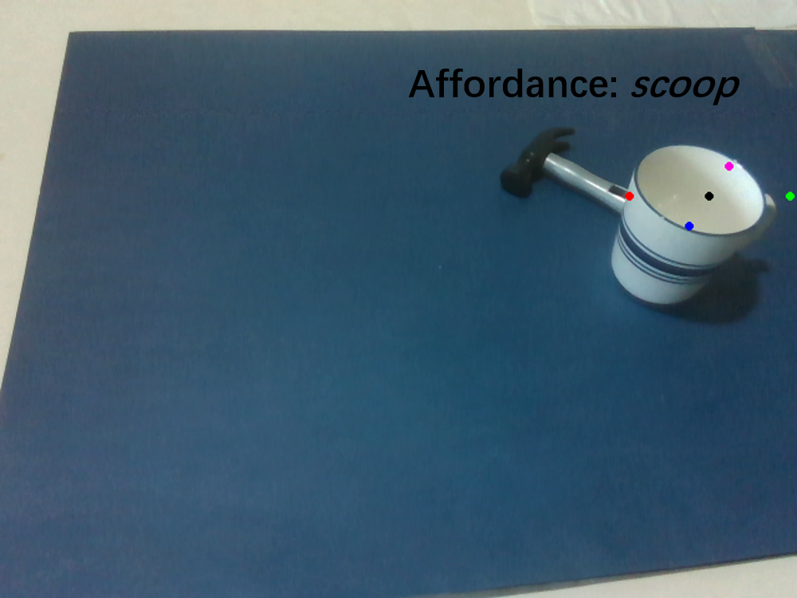
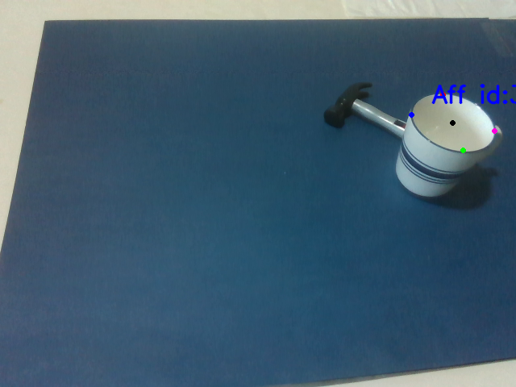
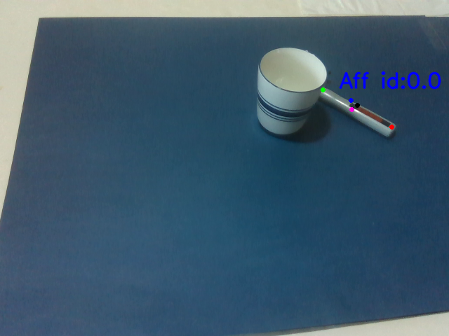
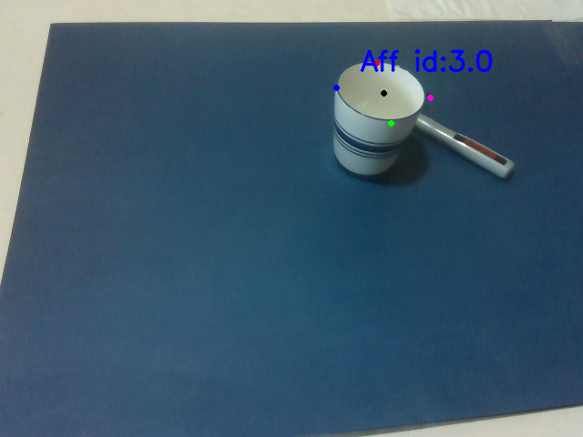
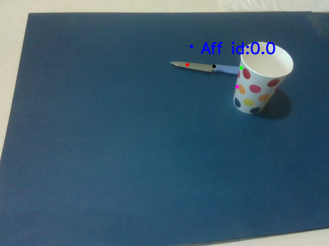
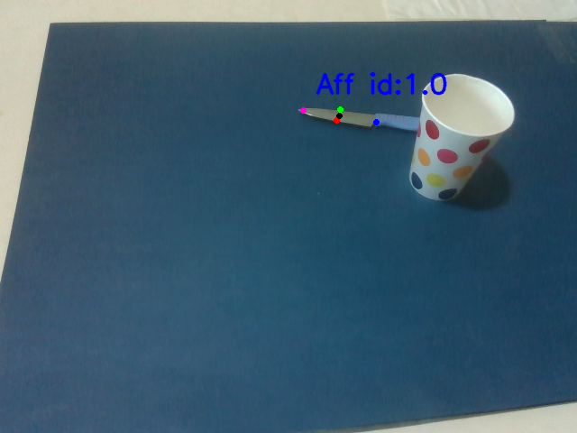
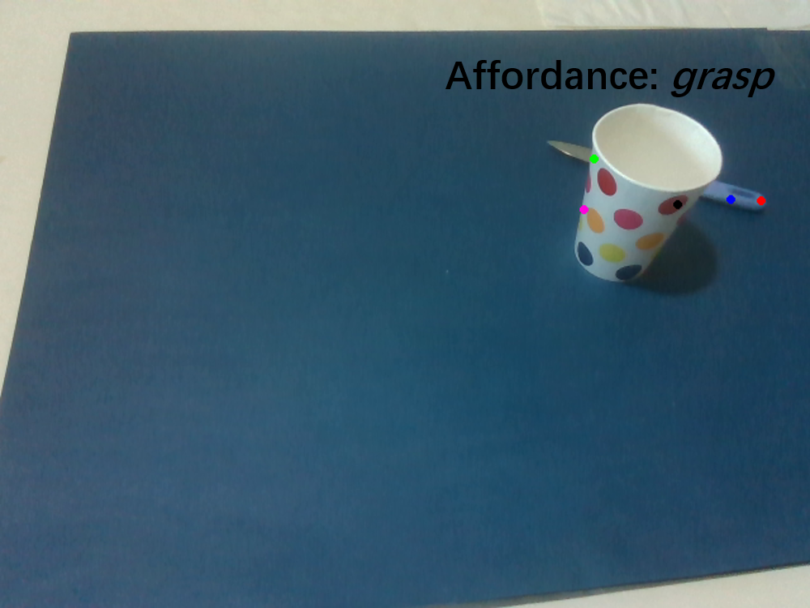

## Introduction
This markdown file includes the investigation result of performing the proposed network for the occlusion scenarios. Since the current keypoint grouping algorithm only supports outputing one keypoint group for each category, we only include objects whose affordance categories are different. 

## Visualization

### Scene 1

### Scene 2

### Scene 3

### Scene 4

## Observation

## Investigation
