## Introduction
This markdown file includes the investigation result of performing the proposed network for the objects outside of the training distribution. For the object outside of the training distribution, we refer to the object not only with unseen object category but also shares the different geometry from objects in the training dataset. For the object in the training dataset, readers can refer to this [markdown file](https://github.com/ivalab/AffKpNet/blob/master/readme/dataset_visualization.md). The test object includes brush, mouse, scissors, sprayer, tennis ball and toy.

## Visualization

### brush

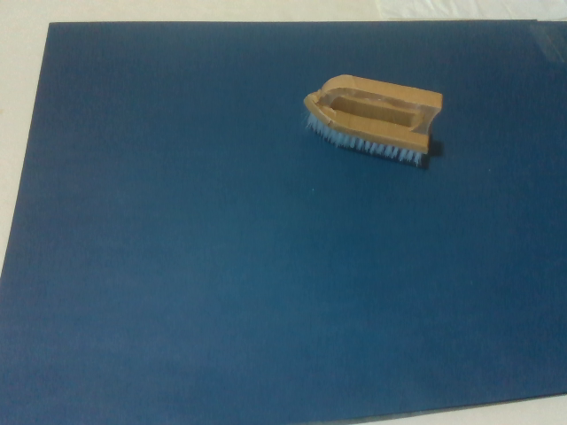

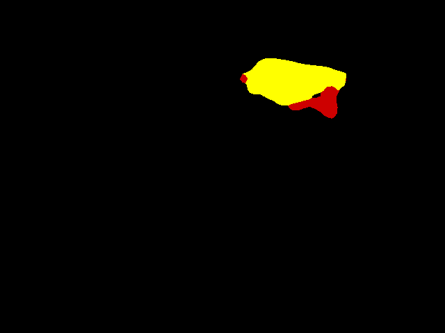

### mouse

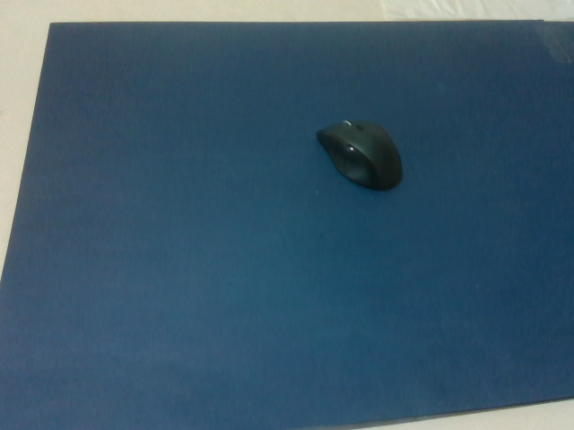

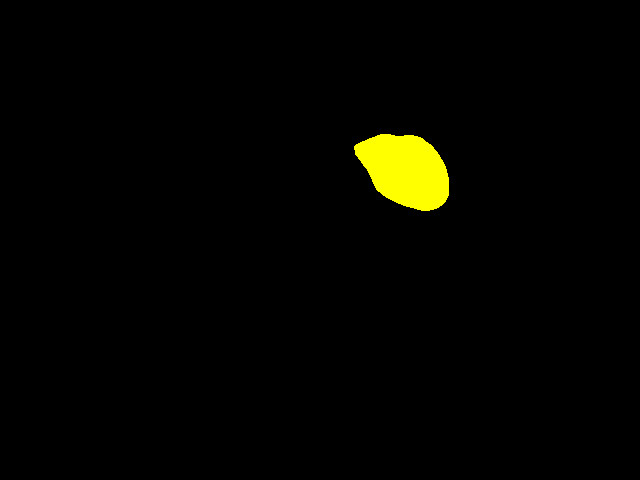

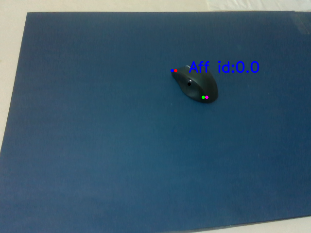

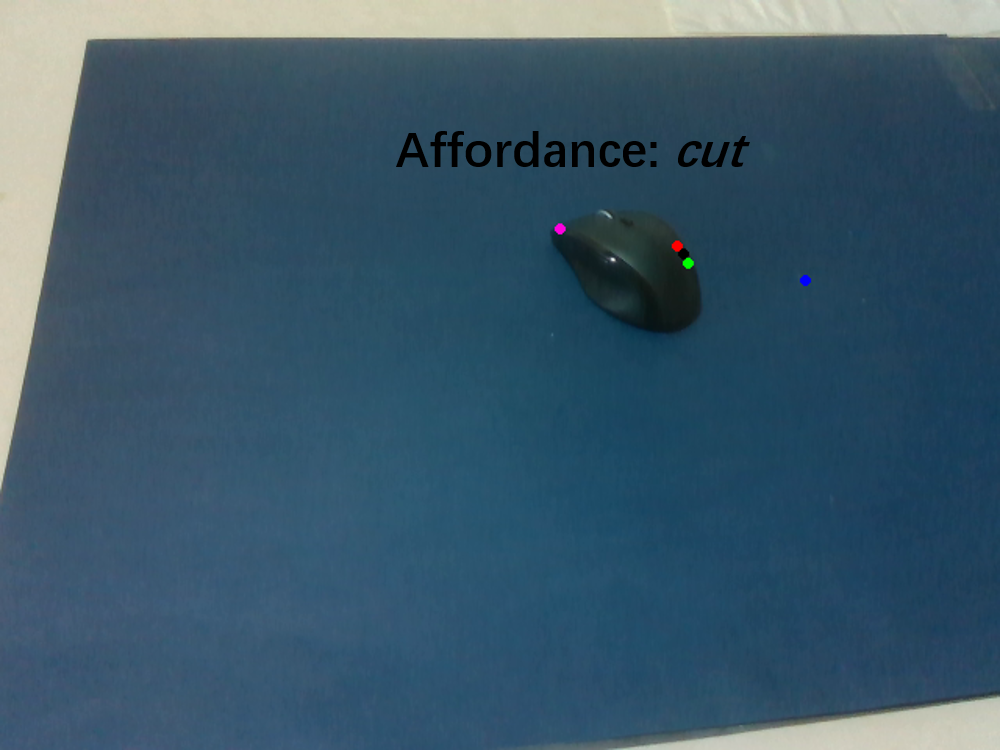

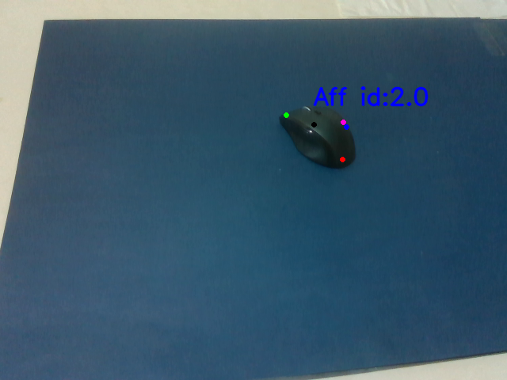

### scissors

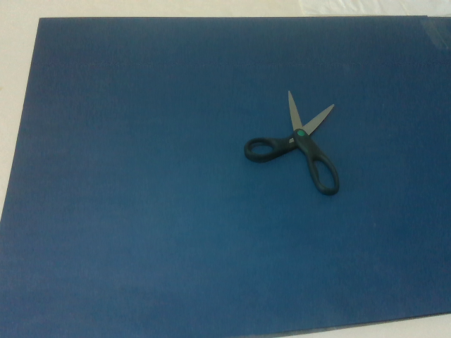

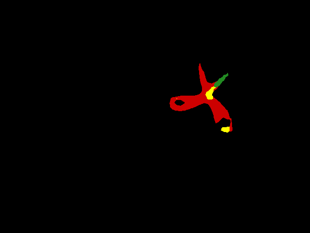

### sprayer

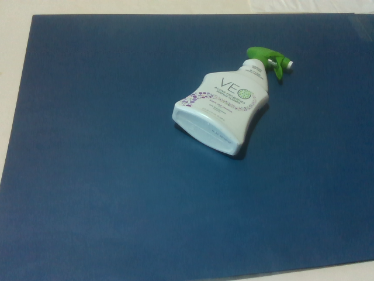

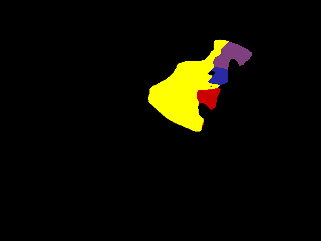

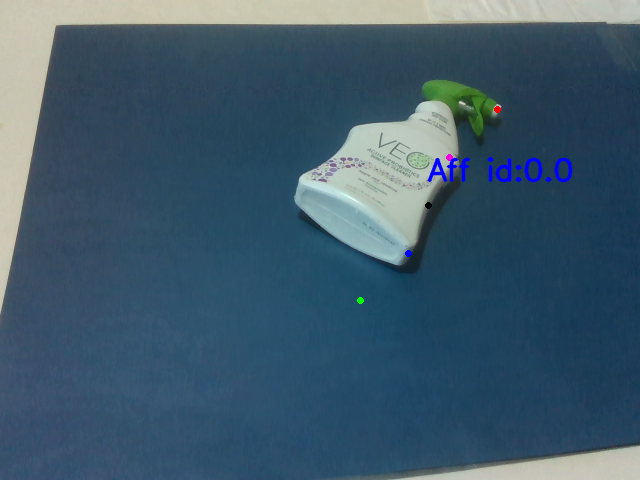

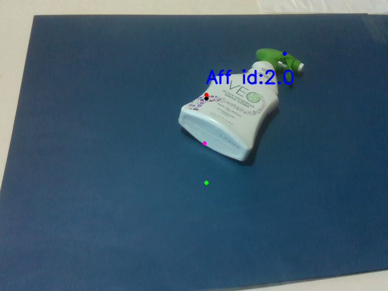

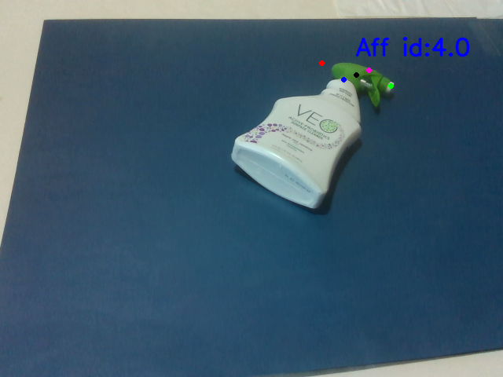

### tennis_ball

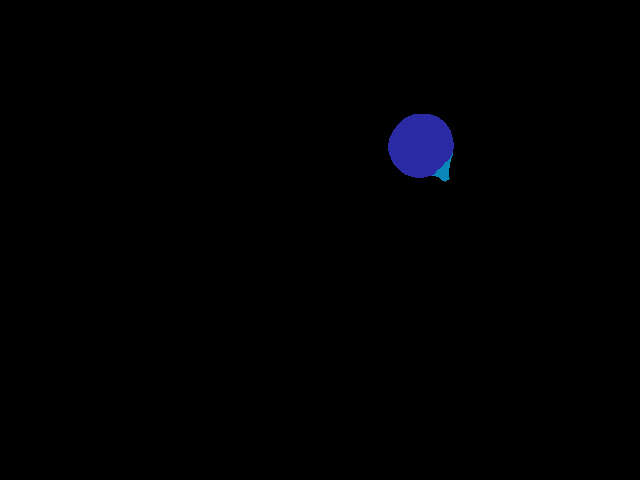

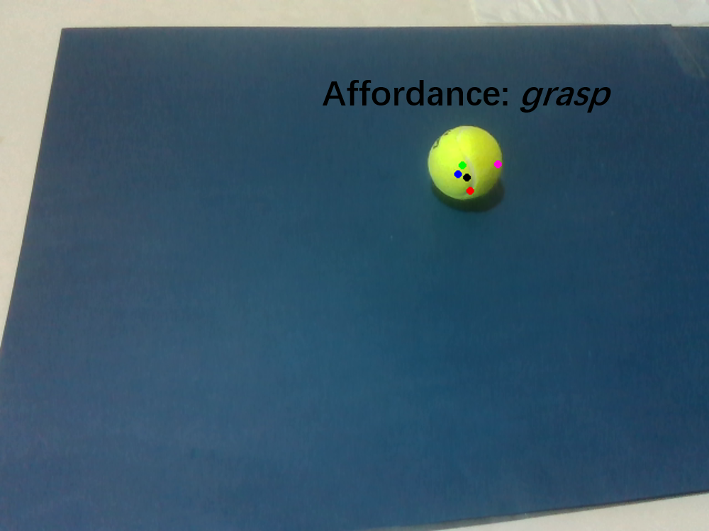

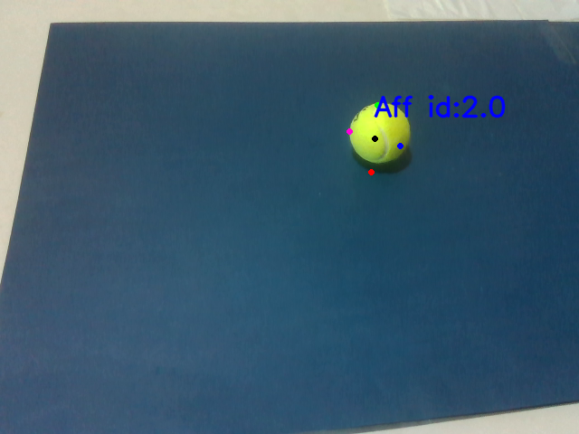

### toy

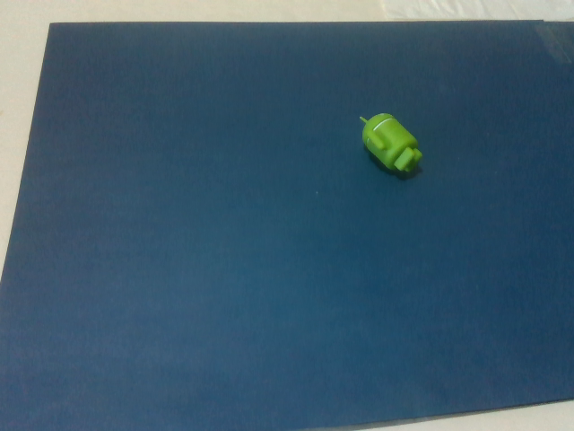

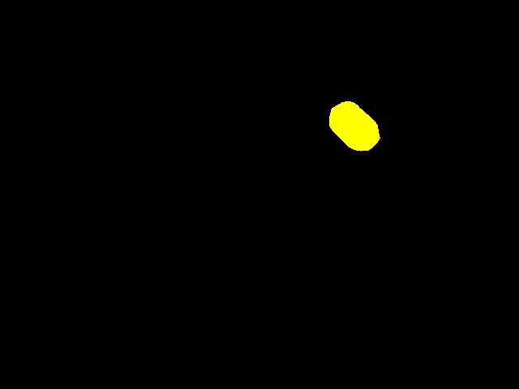

## Observation
From the visualizations, we can find that the proposed network provides the reasonable prediction based on the object's geometry, even though it is incorrect. The most obvious phenomenon is that all objects with large area surface are predicted as the scoop affordance. The tennis ball is predicted as the contain affordance due to its circular shape.  
Surprisingly the scissors gets reasonable affordance mask prediction but the keypoints prediction is compeltely wrong. 

## Investigation
All these objects with large area surface should be predicted as the grasp affordance but they are actually predicted as the scoop. We suspect that the main reason is that all objects with the grasp affordance have the small and bar-like geometry like knife, spoon. In contrast, the object part shares the scoop affordance has the relative flat surface and large area. The prediction for the tennis ball is incorrect but within the expectation. In the training dataset, only object parts which have the contain affordance own the circular shape. The prediction shows that the contain affordance is overfitted to the circular object in some degree. For the scissors, we didn't expect it can have the reasonable prediction but actually it prodvides pretty decent prediction for the segmentation mask. The keypoint predictions for the grasp and cut are incorrect and missing, which is understandable.
