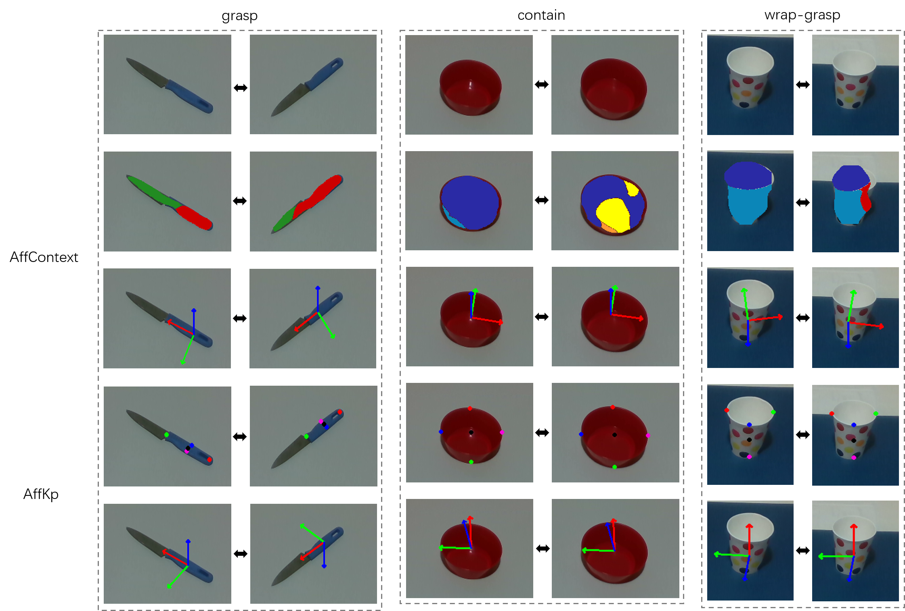

# Overview
Based on predicted segmentation and keypoint, we've demonstrated the comparsion of performance robustness between _AffContext_ and _AffKp_ for objects under different views in the paper. 
To make further comparison in the 3D space, we convert 2D predictions (segmentation or keypoints) to 3D execution-related information. This file documents the investigation in 3D space.

# Rationale
## AffContext
We followed the way that the author provides in the [public repository](https://github.com/ivalab/affordanceNet_Context).
To convert 2D segmentation to 2.5D/3D pose, it requires to compute the center and the principle axis of the affordance mask. By computing the centroid of the mask, the 3D
operational location can be obtained by the corresponding depth image. By the least squares polynomial fit technique, the principle axis is computed for the mask, which is 
the red-axis in the following figure.

## AffKp
The way that _AffKp_ converts 2D affordance keypoints to 3D pose can be referred to [kp_2d_3d.md](https://github.com/ivalab/AffKpNet/blob/master/readme/kp_2d_3d.md).

# Result

# Discussion

As shown in the last two rows of the Figure, _AffKp_ provides consistent affordance keypoints and estimated 3D pose for objects under different views.  Compared to _AffKp_, as 
shown in the second row, affordance segmentation predicted by _AffContext_ can vary a lot under different views, which may leads to the performance drop in the physical 
experiments. As shown in the third row of the knife and bowl, origins of the object frame can shift from the center due to the imperfect segmentation.  For the converted 3D pose 
for the cup, there are two potential problems. Firstly, the principle axes aren't consistent due to different predicted segmentation. Secondly, as the camera view changes, the 
ratio of the height and width of the mask may also change. For example, as the camera view becomes more top-down, the width of the cup may be even longer than the height in the 
view. The result if that the fitted axis will also change, which leads to the inconsistency. 
